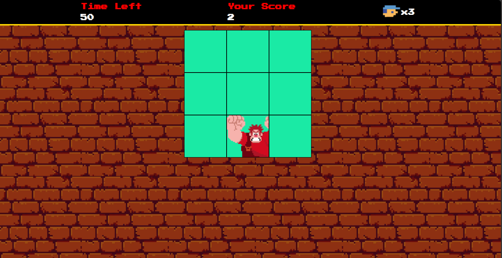

# Detona Ralph (Wreck it Ralph)

[Link do Jogo](https://gustavopereira-dev.github.io/game-wreck-it-ralph/)

É um Jogo Divertido e Tecnológico Inspirado em "Detona Ralph".

Este projeto não é apenas uma fonte de entretenimento baseada no icônico filme Detona Ralph, mas também um exemplo envolvente das possibilidades avançadas de desenvolvimento de jogos com JavaScript.

## Tecnologias Utilizadas

HTML5 e CSS3: Responsáveis pela estrutura visual e estilo do jogo.
JavaScript: Utilizado para implementar a lógica de funcionamento e a interatividade do jogador.
Sprites e Imagens Personalizadas: Criam uma estética vibrante e imersiva que remete ao universo único de Detona Ralph.

## Funcionalidades

Sistema de Pontuação: Clique no quadrado onde Ralph aparece para acumular pontos. Acompanhe sua pontuação em tempo real e desafie seus amigos a superá-la.
Progressão por Níveis: A cada pontuação atingida, o jogador avança para o próximo nível. Cada novo estágio aumenta gradualmente a dificuldade, ajustando o tempo necessário para vencer e o intervalo em que Ralph reaparece nos quadrados.
Modo Infinito: Como o jogo escala de forma progressiva com base em cálculos automáticos pelos níveis, ele não possui um fim definido. O desafio está em ver até qual nível você consegue chegar, administrando suas vidas ao longo da jogatina.
Sistema de Vidas: O jogador perde uma vida se não conseguir concluir uma fase antes do tempo acabar. Ao ficar com zero vidas, uma nova derrota resulta na tela de Game Over. Mas nem tudo está perdido: a cada 100 pontos acumulados, você conquista uma vida extra como recompensa pela sua habilidade.